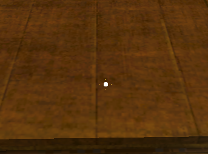
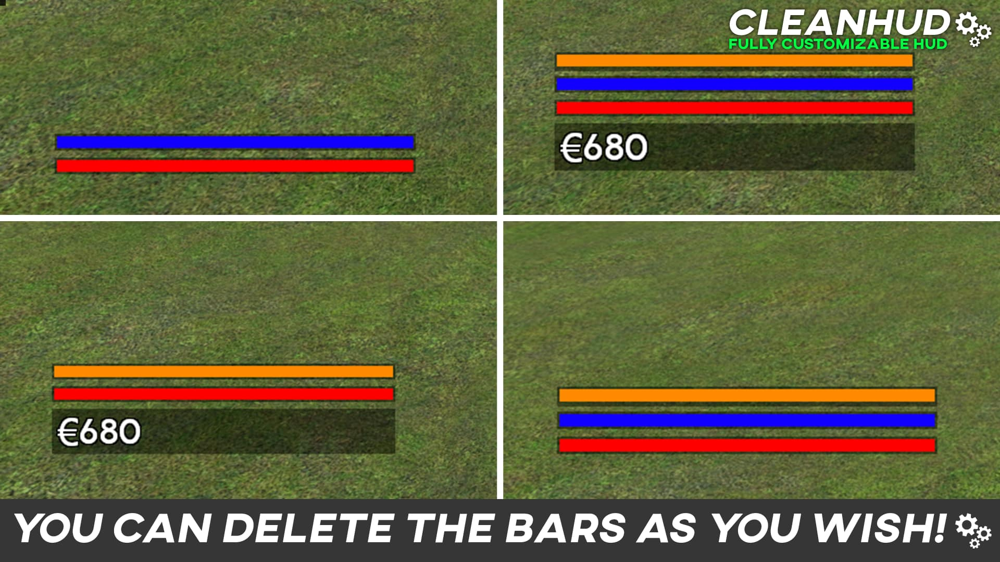
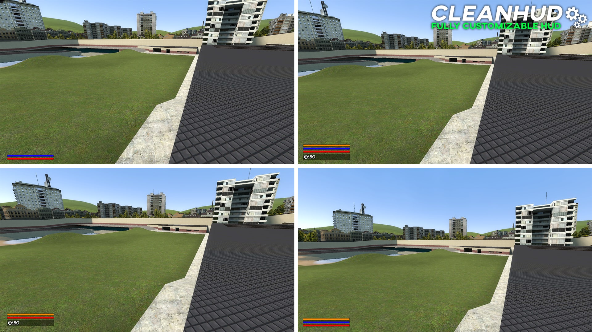

# 💻 lua

!!!note "Definition"
    Lua is a [scripting language](https://fr.wikipedia.org/wiki/Langage_de_script) [free](https://fr.wikipedia.org/wiki/Logiciel_libre), [reflexive](https://fr.wikipedia.org/wiki/R%C3%A9flexion_(computing)) and [imperative](https://fr.wikipedia.org/wiki/Programmation_imp%C3%A9rative).

---

???tldr "Long Definition"
    Created in [1993](https://fr.wikipedia.org/wiki/1993_en_informatique), it is designed to be embedded within other applications to extend them. Lua (from Portuguese: Lua [ˈlu.ɐ], in Brazilian: [ˈlu.a], meaning "Moon") was developed by Luiz Henrique de Figueiredo, Roberto Ierusalimschy (en) and Waldemar Celes, members of the TeCGraf research group, from the [Pontifical Catholic University of Rio de Janeiro](https://fr.wikipedia.org/wiki/Universit%C3%A9_pontificale_catholique_de_Rio_de_Janeiro) in [Brazil](https://fr.wikipedia.org/wiki/Br%C3%A9sil).

    The Lua interpreter is written in the strict [C language](https://fr.wikipedia.org/wiki/C_(language)) [ANSI](https://fr.wikipedia.org/wiki/ANSI), and as such is compilable on a wide variety of systems. It is also very compact, with version 5.0.2 occupying only 95k to 185k depending on the compiler used and the target system. It is often used in [embedded systems](https://fr.wikipedia.org/wiki/Syst%C3%A8me_embarqu%C3%A9) such as [OpenWrt](https://fr.wikipedia.org/wiki/OpenWrt) where this compactness is highly appreciated. It takes advantage of the compatibility that the C language has with a large number of languages to be easily integrated in most projects. It integrates a [garbage collector](https://fr.wikipedia.org/wiki/Ramasse-miettes_(informatique)).

    It is particularly appreciated for embedded, [network](https://fr.wikipedia.org/wiki/R%C3%A9seau) and [video game](https://fr.wikipedia.org/wiki/Jeu_vid%C3%A9o) development.

    Lua is used in video games such as: Transformice, World of Warcraft, Roblox, Garry's Mod, Onset, computercraft mod (Minecraft mod), Multi Theft Auto (Grand Theft Auto: San Andreas multiplayer mod), FiveM (Grand Theft Auto V multiplayer mod), Factorio, as well as video game engines such as SourceEngine, CryENGINE, LÖVE, or Fantasy consoles, such as Pico-8.

    It is also used at the network level as a hook on Apache, Lighttpd (by default), Nginx (via OpenResty), in Cisco routers, in the Wireshark packet analyzer, the Rspamd antispam, the Asterisk private branch exchange (optional), for MediaWiki scripts.
    
__*source: Wikipedia[^wiki1]*__
[^wiki1]: [Wikipedia : Lua](https://fr.wikipedia.org/wiki/Lua)

- [X] Procedural Oriented[^orien1]
- [X] Functional Oriented[^orien2]
- [ ] Object-oriented[^orien3]

[^orien1]: [Wikipedia: Procedural programming](https://fr.wikipedia.org/wiki/Programmation_proc%C3%A9durale)
[^orien2]: [Wikipedia: Functional programming](https://fr.wikipedia.org/wiki/Programmation_fonctionnelle)
[^orien3]: [Wikipedia: Object-oriented programming](https://fr.wikipedia.org/wiki/Programmation_orient%C3%A9e_objet)

## Code examples

### HelloWorld

- To begin, we will see how to write `helloworld` in the lua console:

!!!Note "Write `helloworld`"

    === "Code 1"
        !!!Success "Success"
            === "lua"
                In lua :
                ```lua linenums="1"
                --8<-- "docs/scripts/lua/helloworld/helloworld1.lua"
                ```
                ```bash
                --8<-- "docs/scripts/lua/helloworld/helloworld1console.lua"
                ```

            === "python"   
                Comparison with Python :    
                ```python linenums="1"
                --8<-- "docs/scripts/python/helloworld/helloworld1.py"
                ```
                ```pycon
                --8<-- "docs/scripts/python/helloworld/helloworld1console.py"
                ```
            
    === "Code 2"
        !!!failure "Error"
            === "lua" 
                In lua:
                ```lua linenums="1"
                --8<-- "docs/scripts/lua/helloworld/helloworld2.lua"
                ```
                ```bash
                --8<-- "docs/scripts/lua/helloworld/helloworld2console.lua"
                ```

            === "python" 
                Comparaison Python:
                ```python linenums="1" hl_lines="1"
                --8<-- "docs/scripts/python/helloworld/helloworld2.py"
                ```
                ```pycon
                --8<-- "docs/scripts/python/helloworld/helloworld2console.py"
                ```

### Boucles

- Ici, nous allons voir comment faire une boucle qui envoi dans la console les chiffres de 0 à 10 inclus.

!!!Note "Ecrire `helloworld`"

    === "Code 1"
        !!!Success "Success"
            === "lua"
                In lua:
                ```lua linenums="1"
                --8<-- "docs/scripts/lua/boucles/boucle1.lua"
                ```
                ```bash
                --8<-- "docs/scripts/lua/boucles/boucle1console.lua"
                ```

            === "python"   
                Comparaison Python:    
                ```python linenums="1"
                --8<-- "docs/scripts/python/boucles/boucle1.py"
                ```
                ```pycon
                --8<-- "docs/scripts/python/boucles/boucle1console.py"
                ```
            
    === "Code 2"
        !!!failure "Error"
            === "lua"
                In lua:
                ```lua linenums="1"
                --8<-- "docs/scripts/lua/boucles/boucle2.lua"
                ```
                ```bash
                --8<-- "docs/scripts/lua/boucles/boucle2console.lua"
                ```

            === "python"   
                Comparaison Python (qui fonctionne):    
                ```python linenums="1"
                --8<-- "docs/scripts/python/boucles/boucle2.py"
                ```
                ```pycon
                --8<-- "docs/scripts/python/boucles/boucle2console.py"
                ```

### Mathematics

!!!note "Mathematics"
    Lua, is just like python, a tool to do mathematics.

- Here we will see how to transform this formula into a lua code, which will return the result in the console

$$
\Delta = b^2-4ac
$$

> This formula is used to calculate Delta

!!!Note "Mathematics"

    === "Code 1"
        !!!Success "Success"
            === "lua"
                In lua:
                ```lua linenums="1"
                --8<-- "docs/scripts/lua/delta/delta1.lua"
                ```
                ```bash
                --8<-- "docs/scripts/lua/delta/delta1console.lua"
                ```

            === "python"   
                Comparaison Python:    
                ```python linenums="1"
                --8<-- "docs/scripts/python/delta/delta1.py"
                ```
                ```pycon
                --8<-- "docs/scripts/python/delta/delta1console.py"
                ```
    
    === "Code 2"
        !!!Success "Success"
            === "lua"
                In lua:
                ```lua linenums="1"
                --8<-- "docs/scripts/lua/delta/delta2.lua"
                ```
                ```bash
                --8<-- "docs/scripts/lua/delta/delta2console.lua"
                ```
            === "python"   
                Comparaison Python:    
                ```python linenums="1"
                --8<-- "docs/scripts/python/delta/delta2.py"
                ```
                ```pycon
                --8<-- "docs/scripts/python/delta/delta2console.py"
                ```

    === "Code 3"
        !!!failure "Error"
            === "lua"
                In lua:
                ```lua linenums="1"
                --8<-- "docs/scripts/lua/delta/delta3.lua"
                ```
                ```bash
                --8<-- "docs/scripts/lua/delta/delta3console.lua"
                ```
            === "python"   
                Comparaison Python:    
                ```python linenums="1" hl_lines="2"
                --8<-- "docs/scripts/python/delta/delta3.py"
                ```
                ```pycon
                --8<-- "docs/scripts/python/delta/delta3console.py"
                ```

### Lists

- Here we will see an example to send each element of a list to the console

!!!Note "Lists"

    === "Code 1"
        !!!Success "Success"
            === "lua"
                In lua:
                ```lua linenums="1"
                --8<-- "docs/scripts/lua/listes/listes1.lua"
                ```
                ```bash
                --8<-- "docs/scripts/lua/listes/listes1console.lua"
                ```
            === "python"
                Comparaison Python:
                ```python linenums="1"
                --8<-- "docs/scripts/python/listes/listes1.py"
                ```
                ```pycon
                --8<-- "docs/scripts/python/listes/listes1console.py"
                ```
    
    === "Code 2"
        !!!Success "Success"
            === "lua"
                In lua:
                ```lua linenums="1"
                --8<-- "docs/scripts/lua/listes/listes2.lua"
                ```
                ```bash
                --8<-- "docs/scripts/lua/listes/listes2console.lua"
                ```
            === "python"
                Comparaison Python:
                ```python linenums="1"
                --8<-- "docs/scripts/python/listes/listes2.py"
                ```
                ```pycon
                --8<-- "docs/scripts/python/listes/listes2console.py"
                ```

## Personal projects in lua

!!!info "Projects"
    I personally have projects that are created in lua.

### Hestia RolePlay

!!!quote "Hestia RolePlay"

    { align=right }
    For several years, I have been interested in programming multiplayer servers in lua on Garry's Mod[^gmod].
    [^gmod]: [Facepunch](https://gmod.facepunch.com/) & [Wikipedia: Garry's Mod](https://en.wikipedia.org/wiki/Garry%27s_Mod)

    Recently, some friends and I started to build a multiplayer server together.
    I personally take care of the programming of the whole server.

    My friends are in charge of the website, the server hosting, the community, the design and the graphic charter.

    Our project is really at its beginning.

    Here is our [web site](https://www.hestia-rp.fr/)

!!!info "Gmod Servers"

    [https://wiki.facepunch.com/gmod](https://wiki.facepunch.com/gmod)

### Crosshair HUD

!!!quote "Crosshair HUD"
    I have, for my server, developed several scripts. This one is a simple script to have a customizable pointer on our screen in the game Garry's Mod[^gmod].
    
    | Configuration Meni | Pointer rendering |
    |:---:|:---:|
    | { width=415 } | { width=500 } |

!!!depot "Depot"
    :github-brands: Here is the repository for this mod: [crosshair_gmod](https://github.com/OKONORE/crosshair_gmod)
    { align=center }

### Moderation

!!!quote "Moderation System"
    I also have a start of a mod allowing to do moderation on the server, but no preview can be given now, because the mod is not advanced enough involving **SQL** **databases**, **APIs** and **bots** (maybe in a future update of the site)
    
### Character Interface

!!!quote "CleanHUD"

    !!!info "Information"
        { align=right width=500}
        The HUD I developed is an interface to have the main information of his characters displayed on his screen.
    
    ???+danger "images"
        Here are some images (the images are in English because the target audience was English; images made by a friend):

        | Image 1 |
        |:---:|
        ||
        | **Image 2** |
        ||
        | **Image 3** |
        ||
        | **Image 4** |
        ||

        
    
    !!!depot "repository" 
        :github-brands: Here is the repository for this mod: [CleanHUD](https://github.com/OKONORE/CleanHUD)
        { align=center }
        
        P.S: Added for the occasion
        { align=center }
        
        

### Mod Factorio

!!!quote "FactoWorldWars"
    This mod is this time a mod of Factorio[^factorio].
    This mod aims to turn Factorio into a strategy and logistics game.
    It is **^^very^^** far from being finished, and is for the moment put aside. It is developed by me and another friend.
    [^factorio]: [Factorio](https://www.factorio.com/) & [Wikipedia: Factorio](https://en.wikipedia.org/wiki/Factorio)

    [FactoWorld Wars](https://mods.factorio.com/mod/Factoworldwars)

*[HUD]: Head-up display
